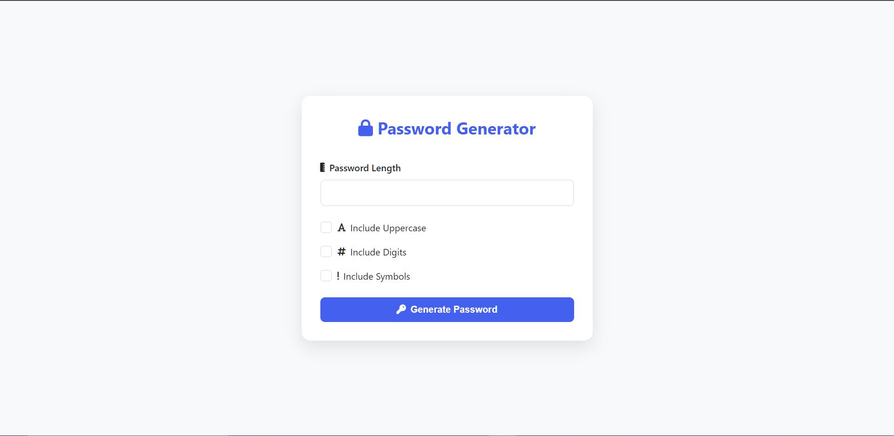
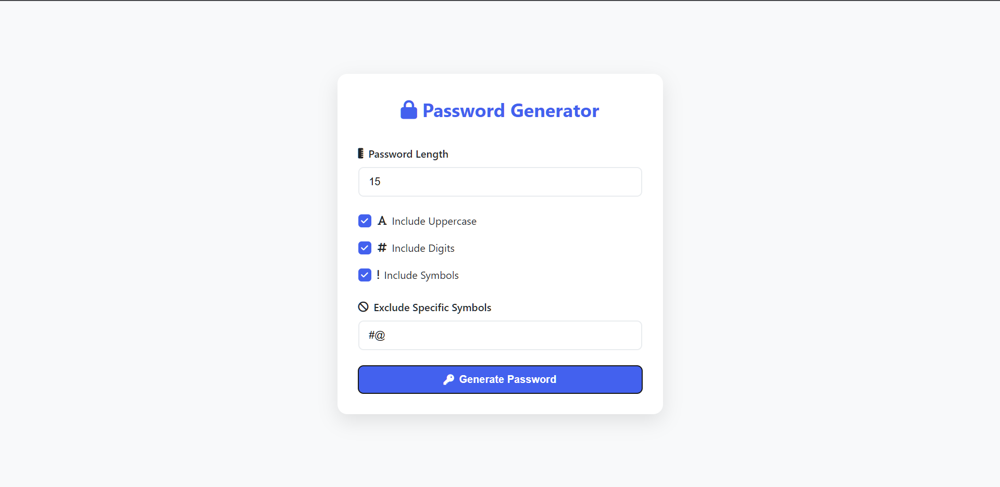
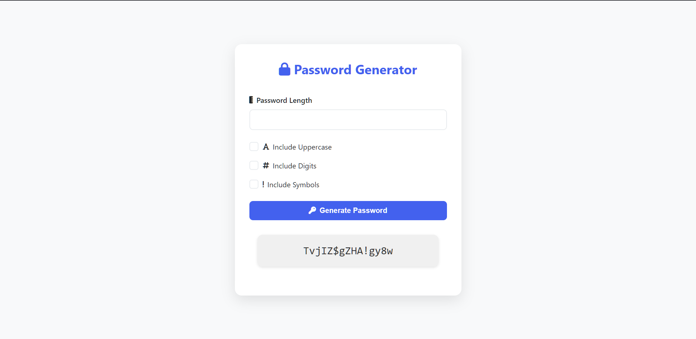

## Secure Password Generator
A simple yet powerful web-based password generator built with Python and Flask, designed to create cryptographically secure passwords with customizable options.
You can access the working web-app at [this site]()!

### Screenshots




### Features
- Generate passwords with customizable length (8-20 characters)
- Toggle options for:
  - Uppercase letters (`A-Z`)
  - Lowercase letters (`a-z`)
  - Numbers (`0-9`)
  - Special characters (`!@#$%^&~`)
 - Secure password generation using Python's `secrets` module

### Installation
#### Prerequisites
- Python 3.11
- pip

#### Steps
1. Clone the repository:
```bash
git clone https://github.com/eXpl017/Web-Password-Generator.git
```
2. Install dependencies:
```bash
pip install -r requirements.txt
```
3.  Run the application:
```bash
flask run
``` 
```bash
# to run in debug mode from cmd line
flask run --debug
```
```python
# to run in debug mode from app.py
# change app.run() to app.run(debug=True)
```
4.  Access the generator at:
```
http://localhost:5000
```

### Project Structure
```text
/password-generator
├── app.py
├── requirements.txt
├── static/
│   ├── style.css
├── templates/
│   └── index.html
└── README.md
```


